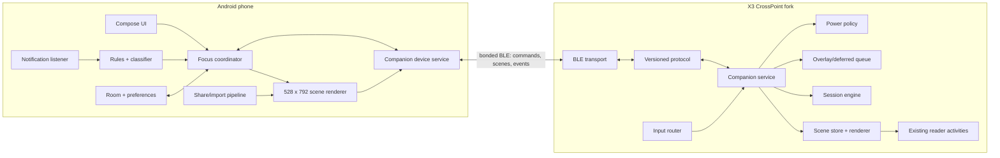
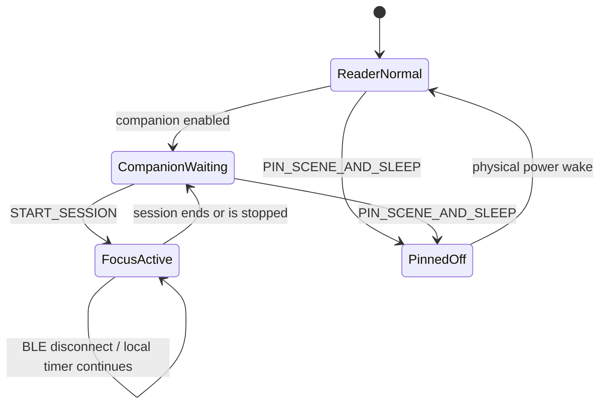

# X3 Companion architecture and implementation plan

Status: firmware research complete; Android/protocol prototype in progress, 2026-07-22

## Product decision

The phone is the computer. The XTEINK X3 is the always-visible rear display and physical control surface.

The first product slice is **focus**, not a collection of independent X3 apps:

1. Normal operation remains unchanged. CrossPoint is still a reader and no notification filtering is active.
2. The user explicitly starts a focus session in the Android app.
3. The phone configures the session and classifies notifications. The X3 owns the visible countdown, deadline handling, already-delivered deferred cards, and buttons.
4. Urgent notifications may interrupt on the X3. Important non-urgent notifications are held until the session ends. Everything else is suppressed or counted.
5. The X3 completes the timer even if BLE disconnects. It does not require the phone to send a tick every second or minute.
6. Deep sleep is not used during an active focus session. It is used only for explicitly pinned static scenes such as a boarding pass, QR code, address, or shopping list.

Pomodoro is therefore a phone feature built on generic firmware primitives: scene, session, field, overlay, deferred card, action, and power policy. There should be no hard-coded `PomodoroActivity` in firmware.

## Requirements

### Required for the focus MVP

- Android app written in Kotlin with a Compose UI.
- X3-only pairing and capability discovery over BLE.
- Focus is started, paused, resumed, and ended from the phone app.
- Configurable focus and break durations; 25/5 is a preset, not firmware behavior.
- The phone sends an absolute deadline and a rendered base scene.
- The X3 updates the visible countdown locally at minute boundaries and at session transitions.
- Notification triage is enabled only during an active focus session.
- Deterministic user rules override any model: selected contacts, calls, alarms, security alerts, apps, conversations, and emergency phrases.
- Three classification results: `IMMEDIATE`, `AFTER_FOCUS`, and `IGNORE`.
- Low-confidence results default to `AFTER_FOCUS`, not interruption.
- Important deferred items already sent to the X3 survive a temporary phone disconnect.
- On completion, the X3 shows a digest and emits `SESSION_FINISHED` to the phone.
- X3 buttons expose generic action IDs. The phone decides what those actions mean.
- Reader state is preserved when entering and leaving companion mode.

### Required for pinned static scenes

- The app can send a complete 528 x 792 monochrome scene.
- `PIN_SCENE_AND_SLEEP` renders the scene, persists minimal metadata, disables radios, and follows CrossPoint's existing display/power-off path.
- The pinned image remains visible with the MCU off.
- The app clearly states that a pinned scene cannot be changed remotely until the user physically wakes the X3.
- Companion content is stored separately under `/.crosspoint/companion/`; it must not overwrite the user's CrossPoint sleep-image configuration.

### Later capabilities built on the same runtime

- Screenshot/share import for boarding passes and other barcodes.
- A ticket live-pane mode with status supplied by Android while the X3 remains connected.
- Calendar, lists, navigation instructions, phone status, now playing, camera shutter, and find-phone actions.
- An opt-in Gemini cloud classifier behind a stable classifier interface.
- Wi-Fi escalation for books, firmware, and unusually large assets.

### Explicit non-goals for the first release

- No cloud dependency for the local timer, deterministic rules, BLE control, or static tickets.
- No live map or phone-screen mirroring.
- No free-text reply UI on the X3.
- No automatic focus start.
- No background Gemini Nano dependency.
- No automatic unauthenticated Wi-Fi transfer.
- No attempt to upstream the complete companion runtime before it is proven. CrossPoint's published scope rejects interactive apps and persistent active connectivity.

## What CrossPoint and the X3 already provide

The research clone is CrossPoint `master` at `2754a5f` (version field 1.4.1) on an Arduino/ESP32-C3 PlatformIO target with 16 MB flash and single-framebuffer mode (`firmware/platformio.ini:6-43`). CrossPoint documents approximately 380 KB usable RAM, and the X3 framebuffer is exactly 52,272 bytes: physical 792 x 528 at one bit per pixel (`firmware/open-x4-sdk/libs/display/EInkDisplay/include/EInkDisplay.h:26-35`). Logical portrait is 528 x 792.

The X3-specific hardware currently exposed by the HAL is:

- ESP32-C3, single core.
- DS3231 RTC at I2C address `0x68`.
- BQ27220 fuel gauge at `0x55`.
- QMI8658 IMU at `0x6A`/`0x6B`.
- Seven logical inputs: four front buttons, two side buttons, and power.
- E-paper controller support for fast, half, full, grayscale, and some partial-window commands.
- SD-backed persistence through the serialized `HalStorage` layer.

CrossPoint already has an activity stack, a dedicated render task, orientation-aware rendering, logical button mapping, SD caching, Wi-Fi AP/STA transfer, and a sleep-rendering path. These are useful seams, but they are not a companion runtime.

## Confirmed firmware gaps

| Gap | Evidence | Design consequence |
|---|---|---|
| No BLE transport | There are no Bluetooth, BLE, GATT, or NimBLE references in the current firmware or SDK. | Add a small BLE peripheral using the lighter ESP-NimBLE stack and measure heap before choosing final buffers and queue sizes. |
| UI has no background activities | `ActivityManager` explicitly says it has no pause/resume or background activity concept (`firmware/src/activities/ActivityManager.h:21-34`). | `CompanionService` must live outside the activity lifecycle. A `CompanionSceneActivity` is only its visible surface. |
| RTC API is time-of-day only | `HalClock::getTime` reads three RTC registers and returns only hour/minute (`firmware/lib/hal/HalClock.cpp:50-86`). | Extend the HAL to full UTC date/time before using epoch deadlines or reboot recovery. Keep application time-zone formatting on the phone. |
| Current deep sleep removes MCU power | The power manager pulls GPIO13 low and notes that the MCU is completely powered off (`firmware/lib/hal/HalPowerManager.cpp:63-95`). | Active focus uses BLE modem sleep/CPU throttling, not deep sleep. Static pinned scenes may use the existing power-off path. |
| RTC alarm wake wiring is unproven | CrossPoint uses the DS3231 only over I2C and exposes no alarm interrupt GPIO. Public firmware analysis maps every usable ESP32-C3 GPIO but does not identify an RTC interrupt route. | Do not make autonomous power-off timer wake a v1 requirement. It is unnecessary for the active-session design. Investigate with a continuity test only as a later hardware experiment. |
| X3 window updates are not actually windowed | `EInkDisplay::displayWindow` deliberately routes X3 through full-frame `displayBuffer` (`firmware/open-x4-sdk/libs/display/EInkDisplay/src/EInkDisplay.cpp:1648-1657`). | MVP refreshes the full framebuffer with the X3 fast differential waveform once per minute. True X3 partial refresh is a separately measured firmware task. |
| Generic scene/session persistence is absent | Existing state covers reader/settings data under `/.crosspoint/`. | Add versioned, CRC-protected companion files and bounded queues through `HalStorage`. |
| Existing bulk server is not safe for automatic launch | AP mode is intentionally open (`firmware/src/activities/network/CrossPointWebServerActivity.cpp:23-24`), and HTTP/WebSocket routes have no session token (`firmware/src/network/CrossPointWebServer.cpp:132-195`). | Do not auto-start it. A later bulk-transfer adapter must use a per-transfer WPA2 password and one-time token, then shut down. |
| Memory is tight | Single-buffer mode keeps one 52,272-byte X3 framebuffer; the render task already has an 8 KB stack (`firmware/src/activities/ActivityManager.cpp:22-29`). | Use bounded static queues, stream scene chunks directly to SD, avoid holding a second framebuffer, and establish heap/stack gates on hardware. |

The DS3231 itself supports date/time and alarm registers, so extending the RTC software is straightforward. What is unknown is whether its alarm output is routed to a usable wake/power-latch input on this board. The current product does not depend on that routing.

## High-level architecture



### Ownership boundary

Android owns:

- Feature logic and UX.
- Notification access, rules, semantic classification, and DND integration.
- Scene layout and previews.
- Integrations such as calendar, media, navigation, Wallet screenshots, and sharing.
- Focus history and user preferences.
- Mapping an X3 action ID to an Android operation.

X3 firmware owns:

- Reliable scene display and local field updates.
- Active-session deadline enforcement.
- Bounded persistence of the active scene/session and deferred cards.
- Physical button detection and generic action events.
- BLE pairing, transport, capabilities, and connection state.
- Safe transitions among connected, waiting, reader, and pinned-off power states.

## Android app structure

The prototype uses two Gradle modules rather than an elaborate multi-module graph:

```text
app/                           Compose UI and Android integration
  ui/                          Focus, Read, Tools, themes, passes, settings
  data/                        EPUB/cover reader, SAF folder scanner, persistent cache, Open Library fallback
  focus/                       FocusCoordinator and session state machine
  device/                      CDM association, GATT client, reconnect policy
  notifications/               NotificationListenerService and action adapter
  classifier/                  rules engine, classifier interface, Firebase Gemini adapter
  rendering/                   X3 scene/region renderer and preview
  sharing/                     ACTION_SEND image/text import
  tickets/                     barcode/OCR import and FlightStatusProvider adapters
protocol/                      pure Kotlin codec + golden test vectors
  spec/                        language-neutral protocol specification
  test-vectors/                binary fixtures consumed by Kotlin and C++ tests
```

Keep feature boundaries as packages until build time or ownership makes another Gradle module worthwhile. The protocol is separate immediately because the Kotlin and C++ implementations must share deterministic fixtures.

### Android services

`X3CompanionDeviceService`

- Associates the X3 using `CompanionDeviceManager`.
- Observes device presence and maintains/re-establishes GATT while a session needs it.
- Owns a serialized command queue; Android GATT operations must not overlap.
- Exposes connection/capability/status state as a `StateFlow`.
- Uses a connected-device foreground service only when required by the OS/session behavior.

Android officially supports background BLE companion communication with `CompanionDeviceService` and presence observation. A killed process still ends an ordinary GATT connection, so the firmware must remain locally correct when the phone disappears. See [Android background BLE guidance](https://developer.android.com/develop/connectivity/bluetooth/ble/background) and [companion-device pairing](https://developer.android.com/develop/connectivity/bluetooth/companion-device-pairing).

`X3NotificationListenerService`

- Runs only the triage pipeline when `FocusCoordinator` reports an active session.
- Extracts a minimal normalized record: package, channel, importance, conversation, sender, title/body, category, flags, and ranking metadata.
- Returns from the main-thread notification callback quickly and performs classification on a bounded worker dispatcher.
- Stores only what is necessary for the current session and user review.
- Sends `SHOW_OVERLAY` for immediate items and `QUEUE_CARD` for important deferred items.

`NotificationListenerService` exposes posted notifications and ranking information, including whether an item matched the current interruption filter. See the [official API](https://developer.android.com/reference/android/service/notification/NotificationListenerService.html).

`FocusCoordinator`

- Is the single source of truth for the phone-side session state.
- Starts focus only after the user taps Start.
- Builds the scene, sends `START_SESSION`, and optionally activates the app's DND rule.
- Restores DND state/rule at completion or cancellation.
- Reconciles with `GET_STATUS` after reconnect; the X3's deadline wins for an already-running session unless the user explicitly stops it.

Apps targeting Android 15 or later do not directly own global DND state; calls are represented as the app's `AutomaticZenRule`. The UX must explain and request policy access rather than assuming a global toggle. See [Android 15 DND behavior](https://developer.android.com/about/versions/15/behavior-changes-15#dnd-changes).

`NotificationClassifier`

```text
hard safety rules -> user allow/deny rules -> Gemini for ambiguous items -> confidence/failure policy
```

The rules-only path is complete and usable without a network. During an explicitly active focus session, an opted-in `CloudNotificationClassifier` may send only the ambiguous remainder to Gemini. Deterministic calls, selected people, alarms, security rules, explicit emergency phrases, muted apps, and known noise never wait for a model.

Use the Firebase AI Logic Kotlin SDK with the Gemini Developer API, enforced App Check/Play Integrity, authenticated-user mode, per-user rate limits, and Remote Config for the stable model name and kill switch. Firebase's proxy keeps the Gemini API key off the device; a normal Gemini API key must not be embedded in the APK. The response is constrained to `IMMEDIATE | AFTER_FOCUS | IGNORE`, a short summary, a fixed reason code, and confidence. Timeout, network loss, quota error, safety block, malformed output, or low confidence always becomes `AFTER_FOCUS`.

This cloud path replaces Gemini Nano for live triage. Nano can remain a later foreground-only rule-authoring option, but the production background classifier does not depend on it. See [Firebase AI Logic](https://firebase.google.com/docs/ai-logic), [App Check for AI Logic](https://firebase.google.com/docs/ai-logic/app-check), [structured output](https://firebase.google.com/docs/ai-logic/generate-structured-output), and [Gemini API key security](https://ai.google.dev/gemini-api/docs/api-key).

`SceneRenderer`

- Keeps the full phone composition separate from the approved X3 payload crop; `SceneArtwork` makes both resource choices explicit.
- Renders the crop into a deterministic 528 x 792 one-bit portrait canvas while the app preview uses the full artwork inside the physical XTEINK frame.
- Packs it into the physical 792 x 528 framebuffer order advertised by the X3 capability response.
- Produces full scenes, region bitmaps, and optional digit glyph assets.
- Uses a small shared design system for e-ink typography, quiet zones, borders, and refresh-safe motion.

`EpubFolderScanner`

- Receives only a user-selected `ACTION_OPEN_DOCUMENT_TREE` URI and persists the read grant.
- Recursively enumerates EPUB documents through `DocumentsContract`, with depth and document-count bounds.
- Merges file size and modified time into the library cache at launch; missing entries are marked off-device rather than silently deleted.
- Leaves embedded EPUB metadata authoritative and invokes the cached Open Library fallback only for missing fields.

The app deliberately does not request broad storage permission. Android's Storage Access Framework limits access to the directory tree selected by the user and allows the URI grant to survive restarts. See [Access documents and other files from shared storage](https://developer.android.com/training/data-storage/shared/documents-files).

`ShareReceiverActivity`

- Receives `image/*`, `text/plain`, and later `application/pdf` through `ACTION_SEND`.
- Copies the temporary URI immediately into app-private storage before the sender revokes access.
- For boarding passes, detects Aztec, QR, and PDF417 on-device, validates decoded content, regenerates the code, previews it, and only then sends/pins it.
- Treats Google Wallet share links as hints, not readable pass data. The Wallet object API requires issuer authorization, so the reliable user flow is a shared screenshot.
- Offers `Static` (render then X3 power-off) and `Live pane` (connected BLE with a status region) as explicit, different power modes.

Android documents receiving image/content URIs through `ACTION_SEND` in [Receiving simple data](https://developer.android.com/training/sharing/receive). ML Kit supports on-device Aztec, QR, and PDF417 decoding, but dense PDF417 symbols can require more pixels than the 528-pixel portrait width provides. The ticket milestone therefore includes module-size validation, landscape rendering, and real airport-style scanner testing rather than assuming every decoded code can be displayed safely. See [ML Kit barcode scanning](https://developers.google.com/ml-kit/vision/barcode-scanning/android).

Google Wallet can display flight changes internally, but an ordinary companion app cannot retrieve a user's `FlightObject` by ID: `flightobject.get` requires the issuer OAuth scope. Live-pane data therefore comes from a separate Android `FlightStatusProvider`, initially using airline/Wallet notification-derived updates and later an authoritative flight-data provider if comprehensive polling is required. Gemini may structure text present in a source notification; it must never invent flight status. See [Google Wallet `flightobject.get`](https://developers.google.com/wallet/reference/rest/v1/flightobject/get).

## Firmware structure

The implementation-grade file/change map is in [Exact CrossPoint X3 change plan](crosspoint-change-plan.md). The runtime is isolated under `src/companion/`; the existing reader receives only narrow lifecycle integration points.

```text
firmware/src/companion/
  CompanionService.{h,cpp}       main-loop coordinator; never renders in BLE callbacks
  CompanionProtocol.{h,cpp}      bounded parser, validation, ACK/NACK
  BleTransport.{h,cpp}            GATT server, pairing, bonded peer, queues
  CompanionSceneActivity.{h,cpp} visible surface integrated with ActivityManager
  SceneStore.{h,cpp}              streamed SD persistence and active-scene metadata
  SceneRenderer.{h,cpp}           raw framebuffer + generic dynamic fields
  SessionEngine.{h,cpp}           deadlines, pause/resume, transitions, recovery
  CardQueue.{h,cpp}               bounded overlays and deferred cards
  CompanionInputRouter.{h,cpp}    logical button/gesture to action ID
  CompanionPowerPolicy.{h,cpp}    connected, waiting, pinned-off transitions
```

`CompanionService` is initialized after hardware/storage setup and ticked from `main.cpp`. BLE callbacks copy only small validated fragments into a bounded FreeRTOS queue. The main loop drains commands, performs SD operations through `HalStorage`, updates session state, and requests rendering through `ActivityManager`. No BLE callback may touch the renderer, activity stack, or SD card directly.

The first visible implementation can use `CompanionSceneActivity` as a full-screen mode. The existing reader remains intact and can be resumed. True notification overlays above arbitrary reader screens should wait until focus mode is stable; they require a carefully defined framebuffer snapshot/restore policy.

### Firmware data model

`Scene`

```text
scene_id
revision
orientation
base_framebuffer_asset
dynamic_fields[]
actions[]
power_policy
expires_at_utc (optional)
```

`DynamicField`

```text
field_id
kind: CLOCK | COUNTDOWN | COUNT_UP | PROGRESS | TEXT_VALUE
bounds
style_id
source/deadline
refresh_policy
```

`Session`

```text
session_id
state: RUNNING | PAUSED | FINISHED | CANCELLED
start_utc
deadline_utc
scene_id
finish_scene_id
deferred_delivery_policy
```

`Card`

```text
card_id
session_id
priority
title
body
actions[]
expires_at_utc (optional)
```

Use fixed maximum lengths in the wire/storage format. Do not deserialize arbitrary-length strings or arrays into heap containers. The persisted queue should be bounded; a reasonable starting prototype is 32 cards with a total byte cap, adjusted only after real heap and SD-write measurements.

### Persistence

```text
/.crosspoint/companion/
  active_scene.bin
  active_session.bin
  deferred_cards.bin
  assets/
```

Each file starts with a format version, payload length, and CRC32. Writes go to a temporary sibling file and are renamed only after validation. Scene transfers stream directly to SD and are committed atomically; a partial transfer never replaces the active scene.

## BLE protocol v0

The X3 is the GATT peripheral and Android is the central.

### Characteristics

| Characteristic | Direction | Properties | Purpose |
|---|---|---|---|
| Control | phone -> X3 | write with response | Small commands and state changes |
| Data | phone -> X3 | write without response | Chunked scene/asset bytes |
| Events | X3 -> phone | indicate | ACK/NACK, buttons, session transitions, errors |
| Status | X3 -> phone | read + notify | Battery, mode, active revision, queue depth |

Use indications for state-changing events and notifications only for replaceable telemetry. Negotiate ATT MTU but never assume a particular size.

### Envelope

```text
magic             4 bytes  "X3CP"
protocol_version  u8
message_type      u8
flags             u16
message_id        u32
payload_length    u32
payload_crc32     u32
payload           bytes
```

BLE already provides per-packet integrity. The message CRC protects multi-packet reassembly and the bytes eventually committed to SD. State-changing commands are idempotent by `(bonded_peer, message_id)` so reconnect/retry cannot start a second session or duplicate a card.

### Minimum command set

```text
HELLO / CAPABILITIES / GET_STATUS
BEGIN_SCENE / SCENE_CHUNK / COMMIT_SCENE / ACTIVATE_SCENE
START_SESSION / PAUSE_SESSION / RESUME_SESSION / STOP_SESSION
SHOW_OVERLAY / DISMISS_OVERLAY
QUEUE_CARD / REMOVE_CARD / CLEAR_SESSION_CARDS
SET_ACTION_MAP
PIN_SCENE_AND_SLEEP
```

Events:

```text
ACK / NACK
BUTTON_EVENT
SESSION_STARTED / SESSION_PAUSED / SESSION_FINISHED / SESSION_STOPPED
OVERLAY_DISMISSED
STATUS_CHANGED
ERROR
```

Capabilities include protocol range, device model, firmware version, physical/logical dimensions, framebuffer layout, supported compression, refresh modes, maximum object sizes, maximum cards/actions, RTC availability, battery, and free storage.

Start with raw one-bit frames plus optional simple PackBits-style run-length compression. It is stream-decodable with a tiny fixed buffer and compresses large white regions without allocating a second framebuffer. Do not add a general compression library until transfer and memory measurements justify it.

### Pairing and privacy

- BLE Secure Connections with bonding is mandatory.
- Prefer a six-digit passkey displayed on the X3 and entered on the phone so initial pairing is authenticated rather than “Just Works”.
- Require encryption for all companion characteristics.
- Store only one authorized phone in v0; replacing it requires a physical X3 confirmation.
- Clear notification bodies at session end unless the user explicitly keeps history on the phone.
- Pinned tickets are intentionally persistent and should be removable from both the app and X3.
- Do not use the current open hotspot/server for companion data.

## Power-state model



`FocusActive`

- MCU remains powered.
- Wi-Fi off.
- BLE connected when available; advertise/reconnect when disconnected.
- Long connection intervals and peripheral latency.
- ESP-NimBLE modem sleep and current CPU throttling are evaluated on hardware.
- Full X3 fast-differential update no more than once per minute in v0, plus explicit boundary/overlay updates.
- Session uses a local absolute deadline; the phone never streams timer ticks.

Do not enable automatic light sleep until the X3 clock source and connection reliability are measured. Espressif documents that BLE can remain connected through modem sleep/automatic light sleep, but clock accuracy/configuration matters. See [ESP32-C3 BLE low-power guidance](https://docs.espressif.com/projects/esp-idf/en/stable/esp32c3/api-guides/low-power-mode/low-power-mode-ble.html) and the [ESP32-C3 sleep-mode guide](https://docs.espressif.com/projects/esp-idf/en/v5.1.5/esp32c3/api-reference/system/sleep_modes.html).

`CompanionWaiting`

- Static display.
- Slow advertising or a low-duty bonded connection according to measured battery cost.
- No timer refresh.
- Configurable transition back to reader-only behavior.

`PinnedOff`

- Render and persist the final scene.
- Stop BLE and Wi-Fi.
- Put the e-paper controller to sleep.
- Use the existing CrossPoint shutdown path; the e-paper image remains visible while the MCU is off.

## Pomodoro/focus state machine

```text
IDLE
  -> STARTING: user taps Start in app
  -> RUNNING: scene committed, X3 accepted deadline, optional DND rule active
  -> PAUSED: explicit user action only
  -> RUNNING: resume with a new deadline
  -> FINISHING: deadline reached on X3 or phone
  -> REVIEW: deferred digest visible, DND released
  -> IDLE: user dismisses review
```

Conflict rules:

- The X3 never starts focus on its own.
- Once `RUNNING`, the earliest valid deadline transition wins and is made idempotent by session ID/revision.
- On reconnect, the phone reads X3 state before issuing mutations.
- If the phone process dies, the X3 timer continues. New notifications cannot be classified until Android restores the listener/device process; the UI must report this degraded state after reconnect.
- If the X3 reboots or loses power, it restores the session after physical wake using persisted state and full RTC date/time. Autonomous power-on at the deadline is not promised.
- Midnight and time-zone changes do not alter an already-started duration. The protocol uses UTC; local formatting belongs to Android.

## Key trade-offs and revisit points

| Decision now | Benefit | Cost / revisit trigger |
|---|---|---|
| Full phone-rendered one-bit scene plus a few structured fields | Arbitrary future screens without reflashing; only timer-like elements need firmware rendering | Add more structured widgets only when measured transfer or storage cost justifies firmware complexity. |
| BLE for all v0 traffic | One paired, low-power channel and no network setup | Add authenticated Wi-Fi escalation only if measured BLE transfer time is unacceptable for a real asset class. |
| Full fast X3 refresh once per minute | Uses a known driver path and de-risks the focus MVP | Implement true window refresh when physical tests show battery, flicker, or ghosting is unacceptable. |
| Dedicated companion scene for the MVP | Clean ownership and easy reader recovery | Add overlays over arbitrary reader pages only after snapshot/restore and input arbitration are proven. |
| Deterministic rules before Gemini | Truly urgent/known cases stay predictable and do not wait for a network; Gemini can handle only ambiguous language | Cloud triage is opt-in, paid-project backed in the EEA, measured against a rules-only baseline, and fails to `AFTER_FOCUS`. |
| One bonded phone in protocol v0 | Simple authorization, state reconciliation, and privacy | Revisit multi-phone ownership only if there is a concrete sharing use case. |
| CrossPoint fork / compile-time companion option | Protects reader stability and respects upstream scope | Propose smaller reusable pieces upstream after memory, power, and reliability evidence exists. |
| `:app` plus `:protocol` Android modules | Clear cross-language boundary without early build-graph overhead | Split features when build time, team ownership, or reuse creates a real need. |
| Static ticket by default; live pane is explicit | The boarding pass remains available with the X3 fully powered off | Live gate/status updates require the X3 to stay awake and connected; pin the latest view before scanning if maximum reliability is preferred. |

## Delivery plan

### Milestone 0: hardware and memory spike

- Reproduce a clean CrossPoint X3 build and capture firmware size, free heap, minimum free heap, maximum allocation, render-task stack high-water mark, and idle current.
- Add an X3-only ESP-NimBLE GATT service with `HELLO`, `CAPABILITIES`, `GET_STATUS`, and one button event.
- Measure connected and advertising current at several connection intervals.
- Transfer and CRC-check a 52,272-byte test frame without keeping a second full frame in RAM.
- Exercise 60 consecutive once-per-minute-equivalent fast refreshes and inspect ghosting/latency.

Exit gate: pairing/reconnect is stable, the reader still opens books, no heap leak is visible, and the device has enough measured headroom to continue. If not, reduce BLE roles/buffers and protocol concurrency before adding features.

### Milestone 1: generic scene channel

- Kotlin and C++ protocol codecs share golden test vectors.
- Atomic scene transfer to SD.
- `CompanionSceneActivity` displays an app-rendered scene.
- Button actions reach the phone with scene/action IDs.
- Malformed lengths, bad CRCs, duplicate IDs, disconnect mid-transfer, and out-of-space errors are tested.

### Milestone 2: focus MVP

- Extend `HalClock` to full UTC date/time.
- Add `SessionEngine`, countdown field, pause/resume, completion scene, and recovery.
- Build app focus setup, live screen, X3 preview, and explicit start/stop.
- Add optional app-owned DND rule with onboarding and restoration.
- Confirm that the X3 completes a session after the phone is taken out of range.

### Milestone 3: notification triage

- Add notification-listener onboarding.
- Implement deterministic overrides and user rules.
- Add opt-in Firebase AI Logic classification for ambiguous notifications using structured output and App Check.
- Add strict timeout, quota, offline, malformed-output, and low-confidence fallback to `AFTER_FOCUS`.
- Add immediate overlays, bounded deferred queue, and completion digest.
- Add feedback actions: “should have interrupted” and “should not interrupt”.
- Defer replies/call-back actions until dismiss/snooze/open-on-phone are reliable.

### Milestone 4: pinned static scenes

- Add `PIN_SCENE_AND_SLEEP` and explicit unpin/wake UX.
- Verify display retention and battery behavior.
- Add share-to-X3 for text and images.

### Milestone 5: boarding pass

- Receive screenshots through `ACTION_SEND`.
- Decode Aztec/QR/PDF417 and regenerate with a correct quiet zone.
- Extract only user-confirmed passenger/flight fields.
- Prefer landscape when it gives the barcode safer module dimensions.
- Add a static/deep-power-off mode and a distinct connected live-pane mode.
- Keep barcode bytes immutable while gate/status/time updates patch a separate byte-aligned region.
- Add a `FlightStatusProvider` boundary; label notification-derived data and its freshness honestly.
- Test multiple phones/screenshots and real 1D/2D scanner types before describing it as airport-ready.

### Milestone 6: flight-provider hardening, X3 window refresh, and bulk transfer

- Add an authoritative flight provider only if notification-derived updates are insufficient.
- Evaluate true X3 PTL window refresh; advertise it only after physical DTM/ghosting regression tests pass.
- Evaluate Gemini outcomes against user feedback and the rules-only baseline without increasing false interruptions.
- Add authenticated, time-limited Wi-Fi escalation only if BLE scene/asset transfer is measurably inadequate.

### Delivery track: phone-assisted firmware updates

This is feasible and should be the normal update path after one compatible Xtraordinary/CrossPoint build is installed. The repository already uses dual OTA app partitions and upstream CrossPoint already has firmware-update plumbing, so the companion app does not need to invent unsafe in-place flashing.

- CI builds a versioned firmware artifact from an approved commit, then publishes a signed manifest containing the hardware target, version, image length, SHA-256 digest, minimum compatible bootloader/app version, and download URL. The phone never flashes an arbitrary live branch.
- The Android app downloads and verifies the signed manifest and image, shows the exact version and device target, then transfers the image to the X3's existing updater over a local authenticated channel. The X3 verifies target, size, signature, and digest before writing only the inactive OTA slot.
- The device marks the new slot pending, reboots, confirms a successful health check, and rolls back automatically if the new firmware fails to boot. The app reports progress from device acknowledgements rather than assuming success after upload.
- A first-time bootstrap still requires the existing USB/web-flasher path. Factory USB-locked units must complete CrossPoint's supported unlock/recovery procedure first; the app must detect and explain that state instead of attempting a risky bypass.
- A later Android USB-host/esptool implementation may make first install possible from a USB-OTG cable, but it is a separate, hardware-tested recovery feature. It is not required for the safer day-to-day phone update flow.

Release gate: update, interrupted transfer, bad signature, wrong hardware target, failed boot, rollback, low battery, and loss of phone connectivity all pass on physical X3 hardware before the feature is offered to normal users.

## Verification matrix

Firmware/unit:

- Protocol decode fuzz tests for length, sequence, and CRC failures.
- Golden Kotlin/C++ encode/decode fixtures.
- Session transitions across pause, reconnect, duplicate messages, midnight, and time-zone change.
- Atomic persistence recovery from every interrupted write point.
- Queue overflow behavior is deterministic and visible in status.
- All rendering respects X3 runtime dimensions and every orientation.

Android/instrumented:

- Permission onboarding for companion association, Bluetooth, notification access, DND, and app notifications.
- Process death/recreation and Bluetooth off/on.
- Notification normalization across calls, conversations, grouped notifications, persistent notifications, and redacted lock-screen content.
- Gemini disabled/offline/timeout/quota/safety/malformed responses all take the deterministic fallback path.
- No Gemini API secret is present in the APK or repository; App Check enforcement and the Remote Config kill switch are tested.
- Focus cannot activate from a background notification or X3 reconnect.
- DND rule is always released on stop, finish, crash recovery, and uninstall limitations are documented.

Physical X3:

- Heap and stack telemetry before/after BLE initialization, scene transfer, render, and repeated reconnect.
- Battery/current measurements for reader normal, advertising, connected idle, focus minute refresh, and pinned-off.
- Button handling while rendering and during BLE bursts.
- Ghosting after long focus sessions and repeated overlays.
- SD removal/full/corruption behavior.
- Phone out-of-range and phone reboot during an active session.
- Pinned scene survives X3 power-off and remains readable.
- Live-pane changes never alter barcode bytes; static and live modes communicate their different power/update guarantees.

## Recommended first implementation slice

Build only this vertical path next:

```text
Android connect -> HELLO/CAPABILITIES -> send one scene -> X3 displays it
X3 button -> BUTTON_EVENT -> Android logs it
```

That slice validates the two highest-risk assumptions—BLE memory/power and streaming a full X3 scene—before focus UI, notification permissions, DND, classifiers, or barcode work add noise. Once it is stable, `START_SESSION` and the local countdown become the next change, making Pomodoro the first real product feature rather than a firmware demo.

## Source notes

- [CrossPoint Reader repository](https://github.com/crosspoint-reader/crosspoint-reader)
- [CrossPoint project scope](https://github.com/crosspoint-reader/crosspoint-reader/blob/master/SCOPE.md)
- [XTEINK X3 product page](https://www.xteink.com/products/xteink-x3)
- [ESP32-C3 BLE architecture](https://docs.espressif.com/projects/esp-idf/en/stable/esp32c3/api-guides/ble/overview.html)
- [ESP32-C3 NimBLE GATT data exchange](https://docs.espressif.com/projects/esp-idf/en/latest/esp32c3/api-guides/ble/get-started/ble-data-exchange.html)
- [Android background BLE](https://developer.android.com/develop/connectivity/bluetooth/ble/background)
- [Android notification listener](https://developer.android.com/reference/android/service/notification/NotificationListenerService.html)
- [Android share receiver](https://developer.android.com/training/sharing/receive)
- [ML Kit Prompt API](https://developers.google.com/ml-kit/genai/prompt/android)
- [ML Kit barcode scanning](https://developers.google.com/ml-kit/vision/barcode-scanning/android)
- [Firebase AI Logic](https://firebase.google.com/docs/ai-logic)
- [Firebase AI Logic production checklist](https://firebase.google.com/docs/ai-logic/production-checklist)
- [Firebase AI Logic structured output](https://firebase.google.com/docs/ai-logic/generate-structured-output)
- [Gemini API key security](https://ai.google.dev/gemini-api/docs/api-key)
- [Google Wallet flight object authorization](https://developers.google.com/wallet/reference/rest/v1/flightobject/get)
