# X3 companion connection and power contract

**Status:** Authoritative product contract for companion connection, retry, and
sleep behavior. If another project document conflicts with this file, this file
wins until the conflict is corrected.

This contract keeps three independent concepts separate:

1. first-time phone discovery;
2. reconnecting a phone that is already bonded; and
3. putting the X3 into actual deep sleep.

Home is an awake, usable CrossPoint screen in every connection state. A missing
phone must never turn Home into a power-saving screen, freeze the controls, or
prevent the user from opening books and menus.

## Terms and non-negotiable rules

- **First-pair search** means that the X3 has no stored companion bond and is
  advertising so a phone can discover and pair with it.
- **Bonded reconnect** means that a stored companion bond exists but its GATT
  connection is currently absent.
- **Android retry** is a scan/connect attempt initiated by the phone. The X3 is
  a BLE peripheral: it advertises; it does not periodically “ping the phone.”
- **Home notice** is a small, nonmodal chip. It explains a connection condition
  but does not change the device's power state.
- **Deep sleep** is the existing CrossPoint shutdown path: render the normal
  `SleepActivity` screen, turn Bluetooth off, and enter true deep sleep.

The following rules are mandatory:

- The two-minute limit applies only to an unbonded first-pair search.
- A bonded X3 has no two-minute connection cutoff.
- A disconnected bonded X3 remains usable and connectable until the ordinary
  CrossPoint inactivity timeout or a long power press puts it to sleep.
- A first-pair timeout stops only the extra first-discovery radio work. It does
  not sleep the X3.
- Actual sleep always uses the normal CrossPoint sleep screen. Home or its
  connection notice is never retained as a fake sleep screen.
- Deep sleep has no scan, polling, advertising, or periodic wake.

## State model

| State | Home and controls | X3 BLE behavior | Android behavior | Exit |
| --- | --- | --- | --- | --- |
| Unbonded, first-pair search active | Fully usable | Advertises for at most two minutes | May scan and pair while the app is in the foreground | Successful bond, first-search timeout, or normal sleep |
| Unbonded, first-pair search expired | Fully usable; nonmodal pairing-paused chip visible | First-discovery advertising is off | Must not pretend that opening the app alone can reach the X3 | Explicit **Pair phone** action when implemented, or sleep and physically wake the X3 |
| Bonded, disconnected | Fully usable; no unpaired-timeout chip | Remains connectable; no two-minute cutoff | One immediate foreground attempt, then the configured normal retry cadence; target default is 120 seconds | Connect, forget bond, or normal sleep |
| Connected, awake | Fully usable | GATT connected using the normal profile | Shows Connected and confirms device state | Disconnect, Reading, Transfer, or normal sleep |
| Connected or remembered, Reading | Reader fully usable | Uses the qualified slow-sync policy; leaving Reading requests normal sync immediately | Retains Reading during its configured grace period instead of immediately claiming Disconnected | Leave reader, reconnect, or normal sleep |
| Sleeping | Home is not displayed; normal CrossPoint sleep screen is displayed | Bluetooth is off; no radio work | Persists Sleeping and does not retry | Physical wake |

```mermaid
stateDiagram-v2
    [*] --> Boot
    Boot --> BondedDisconnected: "Stored companion bond"
    Boot --> FirstPairSearch: "No stored companion bond"
    FirstPairSearch --> Connected: "Pair and connect"
    FirstPairSearch --> PairingPaused: "Two-minute first-search timeout"
    PairingPaused --> FirstPairSearch: "Explicit Pair phone or sleep then wake"
    BondedDisconnected --> Connected: "Android scan and connect"
    Connected --> BondedDisconnected: "Unexpected or intentional disconnect"
    Connected --> Reading: "Open reader"
    Reading --> Connected: "Leave reader while connected"
    Reading --> BondedDisconnected: "Link absent; state remains remembered"
    Boot --> Sleeping: "Long press or inactivity timeout"
    FirstPairSearch --> Sleeping: "Long press or inactivity timeout"
    PairingPaused --> Sleeping: "Long press or inactivity timeout"
    BondedDisconnected --> Sleeping: "Long press or inactivity timeout"
    Connected --> Sleeping: "Confirmed shutdown"
    Reading --> Sleeping: "Confirmed shutdown"
    Sleeping --> Boot: "Physical wake"
```

## Timer ownership

| Timer | Owner | Meaning |
| --- | --- | --- |
| Two-minute first-search window | X3 firmware | Bounds advertising only when no companion bond exists |
| Normal reconnect cadence | Android app | Retry interval for a remembered, bonded X3; configurable, target default 120 seconds |
| Reading check-in/grace | Android app and revisioned device state | Avoids a false Disconnected label while the X3 is intentionally in slow Reading sync |
| Home inactivity timeout | CrossPoint firmware, configured by the app | Ordinary 1-5 minute user inactivity timeout that invokes the normal sleep path |
| Long power press | CrossPoint firmware | Immediate user-requested normal sleep path |

The first-pair window and Home inactivity timeout run independently. If the
configured inactivity timeout expires before two minutes, normal sleep wins and
the pairing-paused chip is never shown.

## Required transitions and race handling

- Determine “bonded” from the persisted NimBLE bond store, not from
  `connectedOnceSinceBoot` and not from whether Android is currently running.
- If bonding completes at the first-search deadline, the persisted bond wins:
  do not stop advertising or show the unpaired chip.
- Serialize the connection callback and first-search timeout through the main
  event loop. Recheck the stored bond and current connection immediately before
  stopping first-search advertising.
- If a bond is removed, return to the unbonded first-pair flow and start one
  bounded search window from that deliberate action.
- Returning to Home does not restart a first-pair window by itself.
- Opening Android after first-pair search has expired does not wake or discover
  a non-advertising X3. The UI must explain the required X3 action.
- USB power does not change the state meanings. It may be used for diagnostics,
  but must not silently bypass the product timers.

Until an on-device **Pair phone** action exists, use concise chip copy such as:

> Phone pairing paused · Restart X3 to pair

The chip must use the same subdued selected-element background as the rest of
Home. It is informational, not a modal and not a power indicator. A bonded phone
that is merely absent must not show this chip.

## Firmware implementation boundary

The existing evidence still prohibits periodic advertiser stop/start or
interval mutation at an unsafe clock. The required first-pair timeout is a
different, one-way transition: after rechecking that no bond or connection
exists, stop or fully deinitialize first-discovery advertising once and leave
the CrossPoint UI running normally.

That one-way shutdown must be qualified at a BLE-safe/full-performance clock. If
the available framework cannot stop or deinitialize the advertiser without
blocking controls, the candidate fails; deep-sleeping the whole X3 is not an
acceptable workaround.

The ordinary sleep path must remain the existing CrossPoint path. The companion
layer may send and bound a final `Sleeping / Off` status when connected, but it
must not replace `SleepActivity`, preserve Home as the final frame, or invent a
second shutdown implementation.

## Diagnostics required before behavior changes

Expose these values in the debug-only status snapshot and serial event log:

- `bondedPhonePresent`;
- `firstPairSearchActive`;
- `homePairingNoticeVisible`;
- `advertising`;
- `connected`;
- current CrossPoint activity and sync mode;
- first-search start, expiry, advertiser-stop, connect, disconnect, and sleep
  transition counters.

Callbacks should enqueue or stamp events only. Logs must identify the event and
result without changing timing with continuous output.

## Bounded implementation and validation workflow

1. **Contract gate:** update this contract and remove contradictory statements
   elsewhere before changing firmware.
2. **Observation gate:** add the state diagnostics above without changing
   product behavior. Build one named debug artifact and record its hash.
3. **Baseline gate:** on hardware, record the six states in the
   [diagnostic state matrix](diagnostic-state-matrix.md) using bounded serial
   captures and bounded `adb logcat -d` reads.
4. **Implementation gate:** implement persisted-bond branching and the one-way
   first-search shutdown. Do not combine this with new clock, reader, or UI
   experiments.
5. **Build gate:** run the ISA/multilib/link-map checks in the
   [firmware build runbook](firmware-build-runbook.md), produce one named
   candidate, and record its size and SHA-256. A timed-out build is not retried
   until its process tree is proven stopped.
6. **Flash gate:** flash only that recorded candidate, verify the written
   digest, clear the force-download latch if required, and explicitly leave the
   core running.
7. **Runtime gate:** test unbonded search before and after two minutes, bonded
   absence beyond two minutes, controls in every awake state, normal inactivity
   sleep, long-press sleep, wake, Reading disconnect/reconnect, and app setting
   changes. Record one result before building another candidate.
8. **Battery gate:** only after all functional gates pass, measure Home
   connected, Home bonded/disconnected, Reading connected, Reading
   disconnected, unbonded search expired, and deep sleep separately.
9. **Release gate:** update the runbook with failures and recovery, then commit
   and publish only a candidate that passed the runtime and battery gates.

No build/flash loop is allowed as a substitute for identifying which gate
failed. Observations, hypotheses, source changes, successful compilation,
successful flash verification, and hardware acceptance are separate facts.
